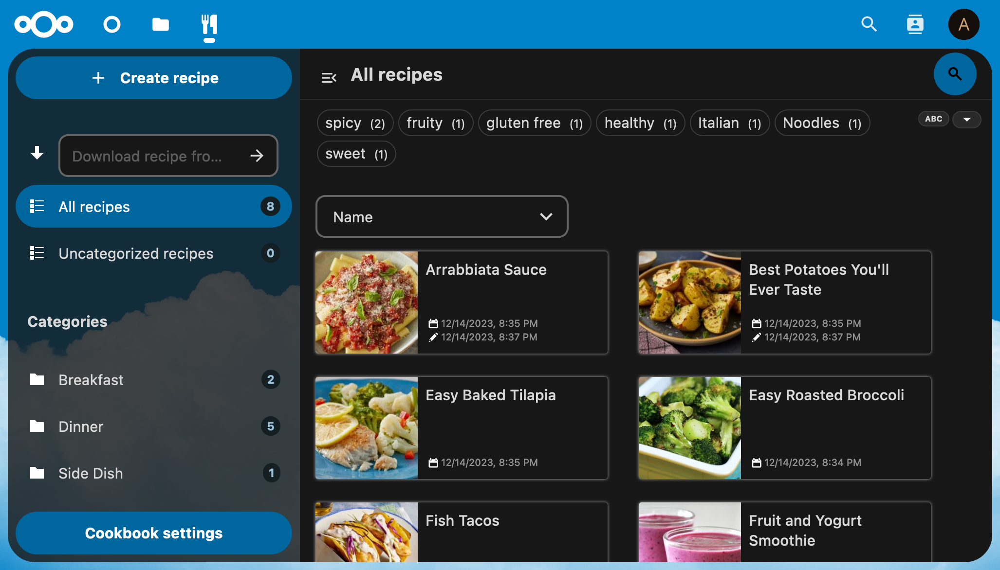

# Nextcloud Cookbook

A library for all your recipes. It uses JSON files following the schema.org recipe format. To add a recipe to the collection, you can paste in the URL of the recipe, and the provided web page will be parsed and downloaded to whichever folder you specify in the app settings.

## 📱 Clients

The app works generally in any modern browser. Additionally, there are some more specialized clients available, including mobile apps for Android and iOS. You can find an overview [here](docs/user/clients/Index.md).

## 📖 Documentation
Further documentation (also internal ones) are published on the [documentation pages of the project](http://nextcloud.github.io/cookbook/) and in the FAQ at the bottom.

## 💼 Is it Production Ready?

> [!WARNING]  
> Users of this app are practically testers. We're limited on resources and still working out how to make this app function the best it can. There will be regressions and bugs. And we of course appreciate constructive feedback whenever users run into them.

## 💰 Sponsoring

We thank the sponsors of this project for their support as open-source software.

 

## 🧑‍🏫  F.A.Q.

  
<b>I can't see my recipes</b>

Recipes are only shown in the UI if they are present in the database. It is likely you have recipes that haven't been indexed/added to the database yet. Try clicking the Settings > Rescan library button to compare the database with what is in your recipes folder and apply any differences to the database.

If this still doesn't work, a full, non-incremental resync might help. This can be done by setting your recipes folder to a different (ideally empty) folder to clear the database. Setting the recipes folder back to what it was before should cause all your recipes to sync again, effectively refreshing the database.

  
<b>"Could not load recipe" when trying to download recipes?</b>

A lot of websites are unfortunately not following the schema.org/Recipe standard, which makes their recipes impossible to read by this app.

  
<b>A website using correct schema.org markup is not being read correctly</b>

The parser is far from perfect. If you can help out in any way, please [have a look at the parseRecipeHtml() method](https://github.com/nextcloud/nextcloud-cookbook/blob/master/lib/Service/RecipeService.php) and create a pull request with your changes.

  
<b>All of the text is in English?</b>

	This app uses the [Transifex](https://app.transifex.com/nextcloud/nextcloud/cookbook/) translation system.
You might want to register there to help translating the app to new languages or report errors in existing translations.

