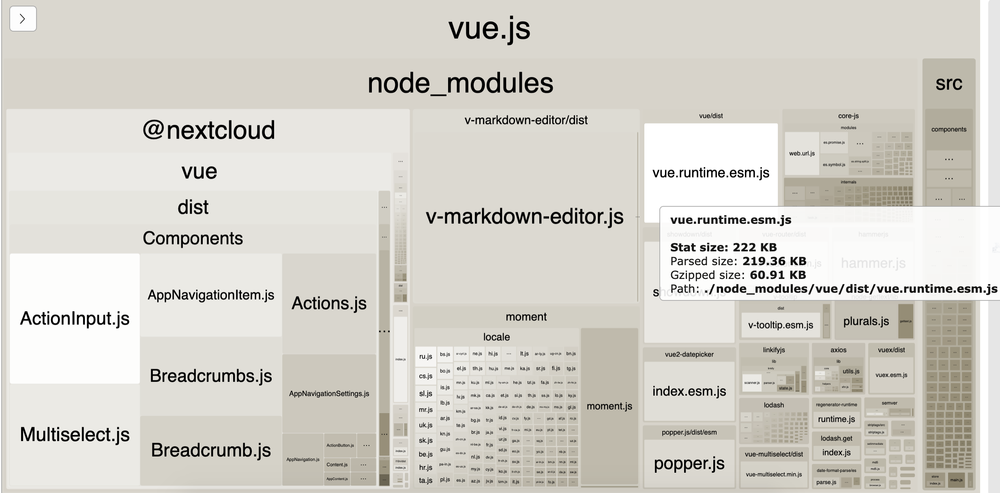

# Webpack Bundle Analyzer

The Webpack Bundle Analyzer Plugin is installed as a development dependency (see `package.json`). It is used to generate an interactive visualization of the bundles content and it’s dependencies and can be helpful for identifying those dependencies that contribute most to the final bundle size. Once those parts are identified the package size might be reduced by replacing large libraries by smaller ones, using tree shaking where possible, code splitting and lazy-loading dependencies, or by other techniques. For more information checkout the [Bundle Analyzer github page](https://github.com/webpack-contrib/webpack-bundle-analyzer).

## Usage

The interactive view of the treemap is available at `http://localhost:8888` while running `npm run build-bundle-analyzer` in the terminal.



The webpage can be automatically opened after running the command by setting `openAnalyzer: true` in `webpack.devel.js`

```
    plugins: [
        new BundleAnalyzerPlugin(
            {
                openAnalyzer: true,
            }
        )
    ],
```
