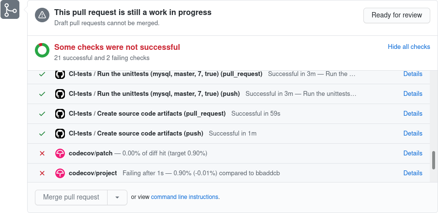
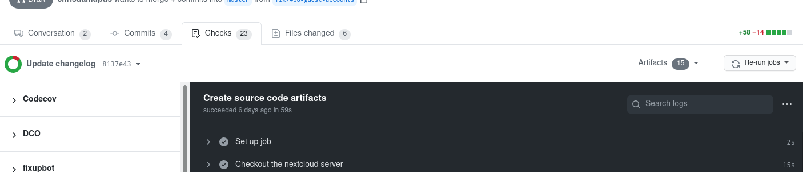
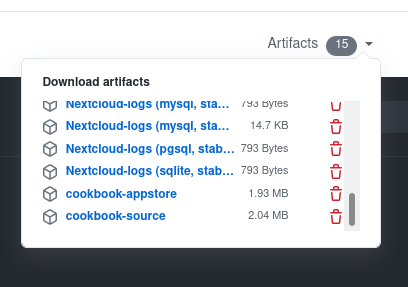
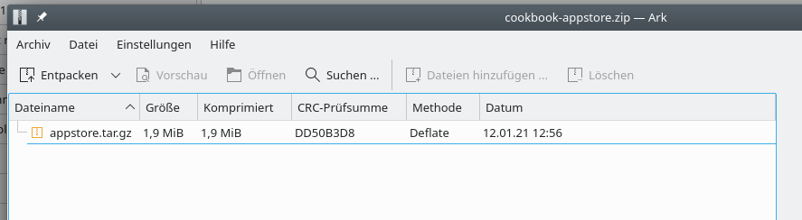
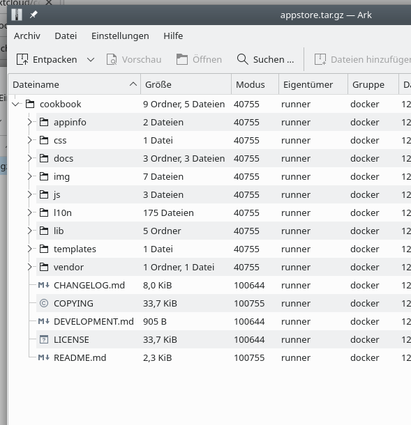

# Using of an automatically built version for testing purposes

Especially for reported issues it might be useful to test if a fix succeeded in fixing an issue if is is not 100% possible to reproduce the problem on the developers' machines.
One way to so is to install the most recent version locally on the nextcloud of the reporting user.

**Warning:**  
Please be sure you have a backup in case anything goes wrong.
There might be other changes between the failing release and the might-be fix that cause change in all set of files.
As a result, it might trigger other bugs and failures as it is merely a development version.
So **make a backup of your files and the database before** installing and proceeding.

## Opening the github checks

At the end of each pull request there is the list of checks:

Click on the link *Show all checks* to open the list.

Scroll down looking for the check *Create source code artifact*.
Typically there will be two, one from the pull request and one from the commit/push.

## Open the action

Click on the details next to the *pull_request* check if present.
You can also use the *push* request if no *pull_request* is present.

You will be brought to such a page:

## Download the artifact

On the right side of the previous image you can click on the text **Artifacts**.
These are files generated during the checks and the build process.
You see a list of these files.

Scroll down and look for an artifact called `cookbook-appstore`.
Download it locally.

## Open the artifact

The artifact is just a plain zip file.
Depending on your machine, you might need to rename the downloaded file to `cookbook-appstore.zip` to open it.

Inside the zip file is another compressed image.
(Sorry, this is a technical requirement of the artifacts.)
Here you see the content of an example artifact file:

Extract the `appstore.tar.gz` file from the zip file to your local hard disc.

This `tar.gz` file contains the cookbook app as installed on the nextcloud server.
You can open this file if you like to have look.
It will have a similar structure as the files on your nextcloud server installation.

## Backup your nextcloud data

Now is definitively the point to make a backup!
Do not skip it if your data are more than dummy data.

It might be even a good idea to backup not only your data but your whole nextcloud installation.
So including the apps and the configuration to simplify restoring.

Make yourself comfortable how to restore the backup.

## Locate the installation folder on the nextcloud

You need to find the installation folder of the cookbook app in your nextcloud installation.
This is typically `/apps/cookbook` or `/custom_apps/cookbook` but could be something else if you have a custom path in your `config/config.php`.

I assume you have your cookbook app installed in `apps/cookbook`.
If your installation is different, you need to change the paths accordingly.

## Remove regular installation

Remove the content of the folder `/apps/cookbook`.
Of course keep the other apps in `/apps` in place, untouched.

Now you should have an empty folder `/apps/cookbook`.

## Upload the build files
Depending on your server you can untar the `cookbook-appstore.tar.gz` file on your server or not.
Anyways, you need to put the content of the folder `cookbook` in the file into the `/apps/cookbook` folder.

There should be a folder `/apps/cookbook/appinfo` with a `.xml` file inside.

## Test the code

When you use the nextcloud now, you should be able to see the new code.
You might need a forced reload of the browser tab if it was still open (typically Ctrl+F5 should do the trick).

Happy testing.

## Further steps

If the fix helped and has no other issues, you can stick with it.
Once a new version is released, it should automatically be updated.

You can of course as well revert the changes and apply the backup.
