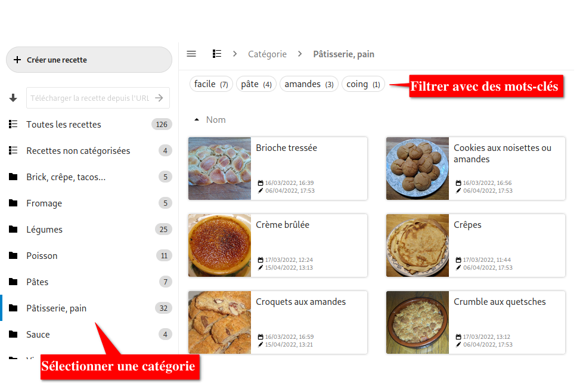

# Documentation d'utilisation
*Attention , cette documentation en français peut ne pas être à jour. Seule la [documentation en anglais](index.md) fait foi !*

## Démarrer avec Cookbook

### Aperçu général

1. Bouton pour créer une nouvelle recette
1. Champ pour télécharger une recette à partir d'une URL
1. Liste des catégories avec le nombre de recettes par catégorie
1. Bouton pour ouvrir/fermer le panneau latéral
1. La catégorie en cours
1. Mots-clés disponibles dans la catégorie en cours avec la nombre de recettes pour chaque mot-clé
    - si un mot-clé devient indisponible parmi les recettes affichées, il devient grisé et non selectionnable
1. Liste déroulante pour différents ordres de tri des recettes
1. Les recettes avec leurs dates de création et de dernière modification

### Où sont mes fichiers

Avant de créer votre première recette, vous devriez décider où seront stockées les recettes et images.

Tous les fichiers seront accessibles dans votre gestionnaire de fichiers Nextcloud.
Cela vous permet d'accéder à ces fichiers depuis une application tierce, en utilisant les applications/clients de synchronisation habituels de Nextcloud.

Par défaut, un répertoire *Recettes* sera situé dans votre répertoire principal.
Vous pouvez simplement vérifier, dans les *Paramètres* de Cookbook, en bas à gauche, dans quel répertoire les recettes seront stockées sur Nextcloud.

## Créer / modifier / supprimer des recettes

### Ajouter une nouvelle recette

Cliquer sur le bouton *Créer une recette* et ajouter un titre et toute information utile. Si un bloc est vide, il ne sera pas affiché dans Cookbook.

### Ajouter une image

Une image peut être ajoutée à la recette. Il y a plusieurs façons de faire cela :

- L'image peut être auparavant stockée sur votre instance Nextcloud. Cliquez sur l'icône à droite du champ image, et sélectionnez l'image. Cette dernière sera alors recopiée dans le répertoire de la recette.

- L'image peut être chargée depuis une URL. Saisissez ou copiez l'URL dans le champ. L'application Cookbook téléchargera l'image et l'utilisera.

### Ajouter un lien

Des liens vers d'autres recettes peuvent être ajoutés dans les champs *Description*, *Ustensiles*, *Ingrédients*, et *Instructions* :

- Tapez un `#` et sélectionnez, dans la liste déroulante, la recette à lier.

### Modifier une recette existante

Cliquer sur la recette, puis cliquer sur le crayon en haut de l'écran.

### Supprimer une recette

Cliquer sur la recette, puis cliquer sur la poubelle en haut de l'écran.

## Utiliser les mots-clés et catégories

L'utilisation des mots-clés et catégories est totalement à votre choix.

La différence principale entre les deux est qu'une recette ne peut avoir qu'une seule catégorie, mais plusieurs mots-clés. En d'autres mots, les catégories sont des relations 1:N, alors que les mots-clés sont des relations N:M.

On peut accéder aux catégories de façon plus directe qu'aux mots-clés car elles sont affichées dans le panneau latéral.

En cliquant sur une catégorie dans le panneau latéral, vous pouvez filtrer rapidement des recettes comme "Légumes" ou "Pâtisserie". Les mots-clés peuvent ensuite être utilisés pour réduire la sélection avec des étiquettes comme "amandes" ou "facile". De cette façon, les catégories opérent un filtrage large, et les mots-clés vont permettre d'affiner ce filtrage.

## Importer des Recettes

### Importer depuis un site web

Les recettes peuvent être importées en entrant une URL de recette dans le champ texte en haut à gauche de l'écran.

Cependant l'application Cookbook nécessite que le site de recettes respecte les méta données JSON+LD du [standard des recettes schema.org](https://www.schema.org/Recipe). Les sites ne respectant pas ce standard ne sont à l'heure actuelle pas supportés.

## Partager des recettes

### Partager avec un autre utilisateur Nextcloud

Pour l'instant, la seule façon de partager des recettes est de partager, avec un autre utilisateur Nextcloud, le répertoire Nextcloud qui contient les recettes. À cette fin, le répertoire doit d'abord être partagé depuis le gestionnaire de fichiers de Nextcloud.Ensuite, il peut être indiqué comme répertoire de recette dans les *Paramètres* de l'application Cookbook.

### Partage public

Pour l'instant, il n'est pas possible de partager un lien public vers une recette.
