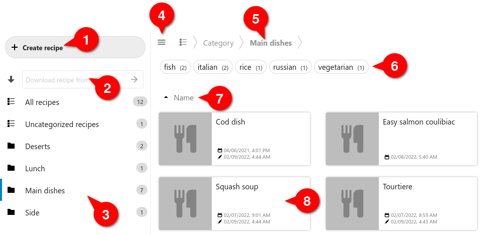
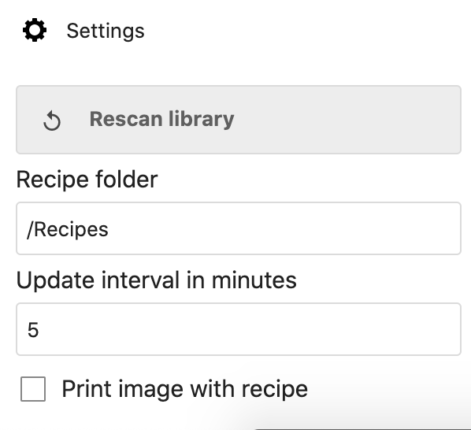
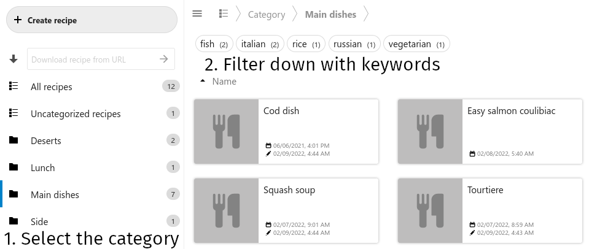
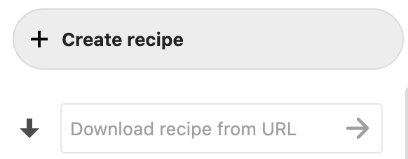

# Usage Documentation
*Other languages : [french](index-fr.md)*

*Warning : the translated documentation could be outdated !* 

## Starting with Cookbook

### How the app looks like

1. Button to create a new recipe
1. Field to download a recipe from an URL
1. List of categories with the number of recipes per category
1. Button to open/close the sidebar
1. The actual selected category
1. Keywords available in the current category with the number of recipes for each keyword
    - if a keyword becomes unavailable among the displayed recipes, it is shaded and unselectable
1. Drop down list for different recipe's sort orders
1. The recipes with their creation date and last modification date

### Where are my files

Before creating your first recipe, you should decide where your recipes and pictures will be stored.

All files will be accessible in your Nextcloud file manager.
That allows you to access your files with 3rd party applications by using the usual Nextcloud file synchronization app/client.

By default, the folder will be a localized folder in your users main folder.
You can simply check in the *Settings* of Cookbook, in the low left corner, in which directory the recipes will be stored on Nextcloud.

## Creating / modifying / removing recipes

### Adding a new recipe

Click on the button *Create a recipe* and add a title and any useful information.
If a block of information is empty, it won't be displayed in Cookbook.

### Adding an image

An image may be added to the recipe. There are multiple ways to get this done:

- The image can be previously stored on your Nextcloud instance. Click on the icon on the right of the image field, and select the image. Doing that, the image will be copied in the recipe's directory.

- The image can be loaded from a URL. Just type or paste the URL in the image field. The cookbook app will download and use the image.

### Adding a link

Links may be added to other recipes in the fields of *Description*, *Tools*, *Ingredients*, and *Instructions*:

- Type a `#` and select, in the pop up list, the recipe to be linked.

### Modifying an existing recipe

Click on the recipe, and then click on the pen on top of the screen.

### Removing a recipe

Click on the recipe, and then click on the dustbin on top of the screen.

## Using keywords and categories

The use of keywords and categories is entirely up to you.

The primary difference between the two is that a recipe can only have a single category,
but may have many keywords.
In other words,
categories are a 1:N relationship while keywords are an N:M relationship.

Categories can be accessed more directly than keywords, as they appear in the sidebar.
By clicking a category in the sidebar, you can quickly narrow down recipes to a certain class, like "Main dishes" or "Deserts".
Then, keywords can be used to further narrow down the selection with tags like "vegetarian" or "easy".
In this way, categories are used for rough filtering and keywords are used for fine filtering.

## Importing Recipes

### Importing from a Website

Recipes can be imported by entering the URL to a recipe in the text-input field in the top left area of the Cookbook app.

However, the Cookbook app requires the recipe site to support the [schema.org recipe standard](https://www.schema.org/Recipe)’s JSON+LD meta data. Those websites which don't provide the required data are currently not supported.

## Sharing Recipes

### Sharing with another Nextcloud User

Currently, the only way to share recipes is by sharing the Nextcloud folder that contains all recipes with another Nextcloud user. To this end, the folder first needs to be shared from the Nextcloud Files app. Afterwards it can be set as the recipe directory in the Cookbook app’s `Settings` section

### Public Sharing

At the moment it is not possible to share a public link to a recipe.
